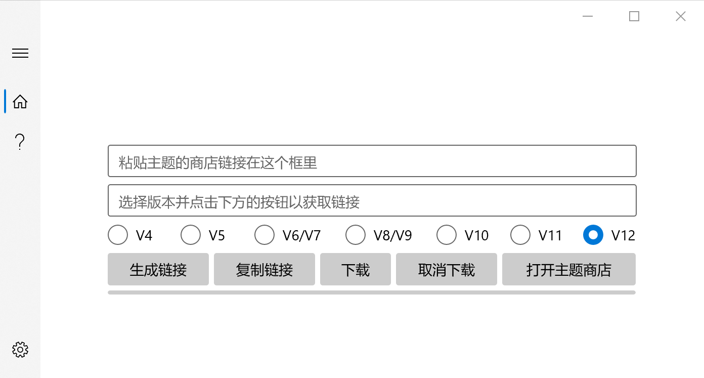

# MIUI 主题下载

这是一个用于下载 MIUI 主题 mtz 包的 UWP 应用。发布在[这里](https://www.microsoft.com/store/productId/9N12V6XN5PRG) 。

之前我在[这里](https://github.com/BDZNH/MIUI-Theme-Download-Link-Generator)发布了 win32 桌面版。

当前支持：

 - 获取主题链接
 - 应用内直接下载主题

## 工作原理
例如，对于主题 `http://zhuti.xiaomi.com/detail/fffdc4b4-9e85-4ac9-8ddd-cc58acaf57d0`，只需要把前面的 `http://zhuti.xiaomi.com/detail/`替换成`https://thm.market.xiaomi.com/thm/download/v2/`，我们得到网址`https://thm.market.xiaomi.com/thm/download/v2/fffdc4b4-9e85-4ac9-8ddd-cc58acaf57d0`，再访问这个网址发起 Get 调用，就可以拿到包含主题下载链接的数据。

### 版本如何来的？
在网址的链接后边加上`?capability=w,b,s,m,h5,v:8,vw&miuiUIVersion=V`，`V`后边跟上MIUI版本号，就可以了。 这个是抓包得到。